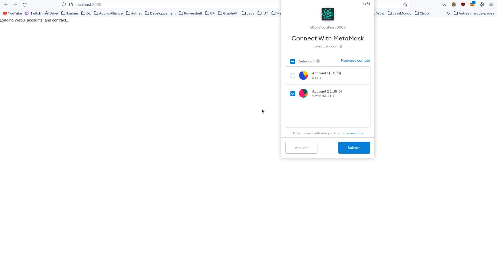

# EthereumPlusOuMoins

## Une dApp simple avec truffle boxes (react) pour jouer au jeu du plus ou moins



## Tester le projet 

### Lancer le réseau local
```
ganache-cli
```

### Se connecter au réseau et importer un compte avec MetaMask
- Déverouiller MetaMask
- Se connecter sur le réseau local (port 8545 par défaut)
- Importer un des comptes fourni par ganache dans MetaMask

### Déployer le contrat

#### Se placer dans le répertoire pour déployer
```
cd EthereumPlusOuMoins/Pendu
```

#### Déployer le contrat
```
truffle migrate
```

### Lancer l'application

#### Se placer dans le répertoire de l'application
```
cd EthereumPlusOuMoins/Pendu/client
```
#### Lancer l'application
```
npm run start
```

#### Consulter l'application
```
http://localhost:3000/
```
